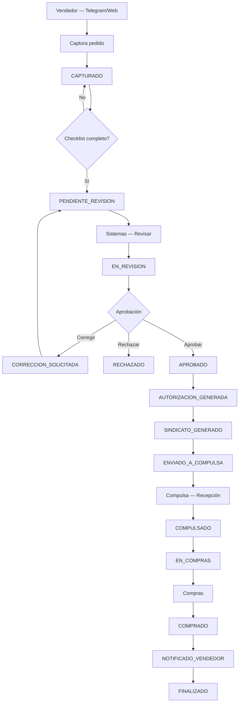

# Flujo Operativo GAMAN

## Modo demo (presentación)

- `DEMO_MODE=true` — ver [DEMO_PRESENTACION.md](DEMO_PRESENTACION.md)
- Login por rol en `/login`
- 5 casos semilla en estados distintos
- Simulador Telegram en `/telegram-demo`

## Diagrama completo



## Corrección crítica: autorización y sindicato

**NO** se generan después de compulsa. Al **aprobar** en Sistemas:

1. `autorizacion.xlsx` — plantilla `plantilla_master_autorizaciones.xlsx`
2. `sindicato.xlsx` — plantilla `formato_autorizaciones.xlsx`
3. Ambos se guardan en la carpeta del caso
4. Estado avanza: `APROBADO` → `AUTORIZACION_GENERADA` → `SINDICATO_GENERADO` → `ENVIADO_A_COMPULSA`

## Tipos de venta y documentos

| Tipo | Documentos requeridos |
|------|----------------------|
| **Mueble** | Orden descuento, Pedido |
| **Dinero** | Pedido, Orden descuento, Carátula banco |

## Roles y pantallas

| Rol | Pantalla | Acciones |
|-----|----------|----------|
| Vendedor | Pedidos / Telegram | Capturar pedido, subir documentos |
| Sistemas | `/sistemas` | Ver docs, revisar, aprobar, corregir, rechazar |
| Recepción | `/compulsa` | Ver autorización/sindicato, compulsar |
| Compras | `/compras` | Marcar compra (Elizondo u Otro), notificar |

## Bot Telegram (captura delgada)

El bot en `telegram_bot/` es un cliente HTTP. **No** revisa, aprueba, genera autorización/sindicato, compulsa ni compra.

| Comando | Acción |
|---------|--------|
| `/nuevo_pedido` | Cliente → tipo (Mueble/Dinero) → fotos → API GAMAN |
| `/mis_pedidos` | `GET /api/vendedores/{telegram_id}/pedidos` |
| `/mis_ventas_hoy` | `GET /api/vendedores/{telegram_id}/ventas-hoy` |
| `/estatus` | `GET /api/vendedores/{telegram_id}/estatus` |

**Orden de fotos:**

- **Mueble:** orden descuento → pedido
- **Dinero:** pedido → orden descuento → carátula banco

Al completar checklist → estado `PENDIENTE_REVISION` → visible en `/sistemas`.

Variables: `TELEGRAM_BOT_TOKEN`, `GAMAN_API_URL=http://localhost:8010`.

## Notificación al vendedor (Telegram)

Al marcar **COMPRADO**:

```
✅ Compra realizada

Folio:
{folio}

Cliente:
{cliente}

Proveedor:
{proveedor}

Pedido:
{numero_pedido}

Estado:
COMPRADO
```

## Demo paso a paso

### Con Telegram

1. Backend `8010`, frontend `3010`, `python telegram_bot/bot.py`
2. Telegram → `/nuevo_pedido` (cliente, tipo, fotos)
3. **Sistemas** → Revisar → Aprobar (genera Excel + sindicato)
4. **Compulsa** → Descargar docs → Marcar compulsado
5. **Compras** → Proveedor + número → Compra realizada (notificación Telegram o mock)
6. Telegram → `/estatus` o `/mis_pedidos`

### Solo Web

1. **Pedidos** → Nuevo pedido (o caso semilla `PED-000001`)
2. **Sistemas** → Revisar → Aprobar
3. **Compulsa** → Compulsar
4. **Compras** → Compra realizada
5. **Dashboard** → KPIs y notificación en historial